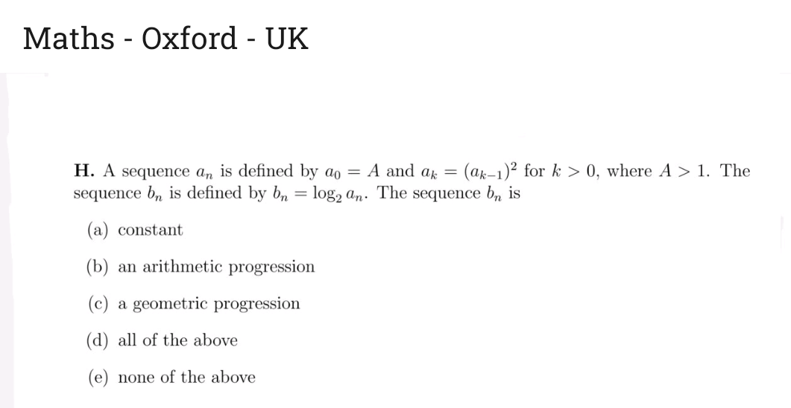

We have,
$a_1=A^2,\quad a_2=(A^2)^2=A^{4},\quad a_3=A^{8},\dots
a_n=A^{2^n}.$
So the Consecutive terms have constant ratio
$\frac{b_{n+1}}{b_n}=\frac{2^{n+1}\log_2 A}{2^n\log_2 A}=2,$

**Answer: (c) a geometric progression.**
