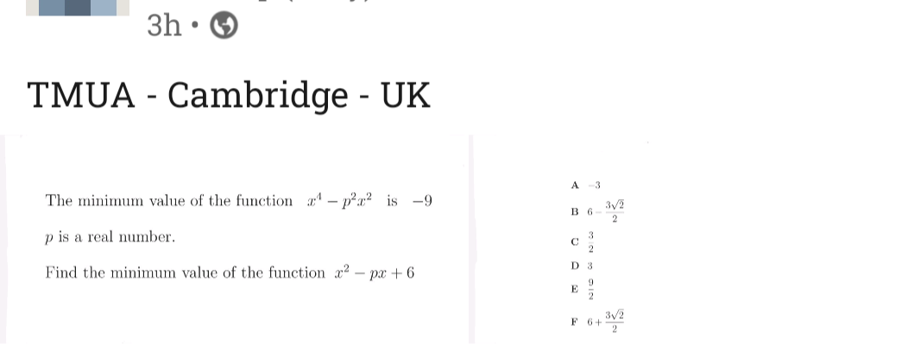

Put $x^2=y$. Then

$f(x)=g(y)=y^2-p^2y$

$g_{\min}=\Big(\frac{p^2}{2}\Big)^2-p^2\Big(\frac{p^2}{2}\Big)=-\frac{p^4}{4}.$

Now consider $x^2-px+6$. Its minimum value is attained at $p/2$.

$h_{\min}=\Big(\frac{p}{2}\Big)^2-p\Big(\frac{p}{2}\Big)+6=6-\frac{p^2}{4}=6-\frac{6}{4}=6-\frac{3}{2}=\frac{9}{2}.$
